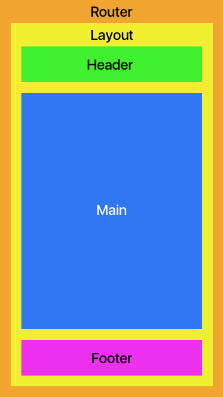
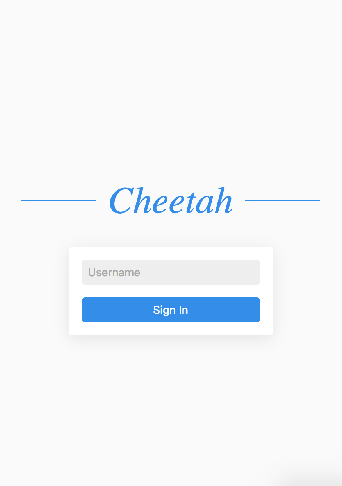
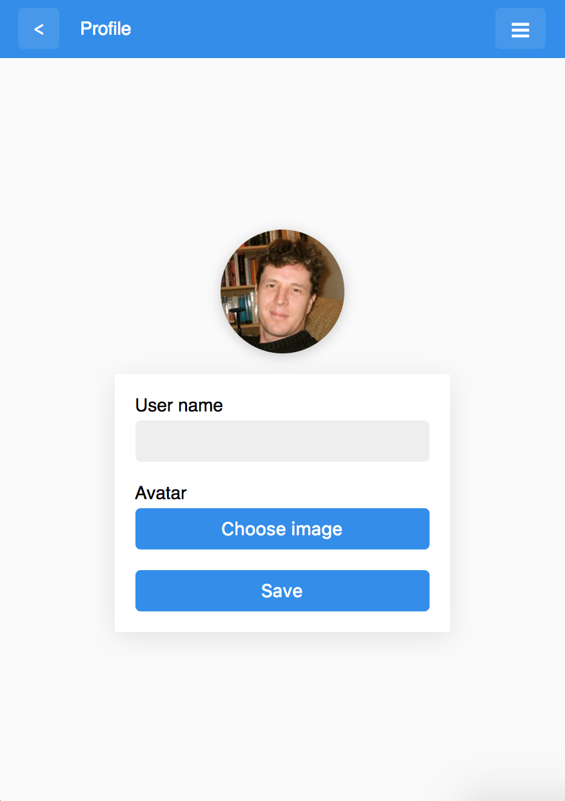
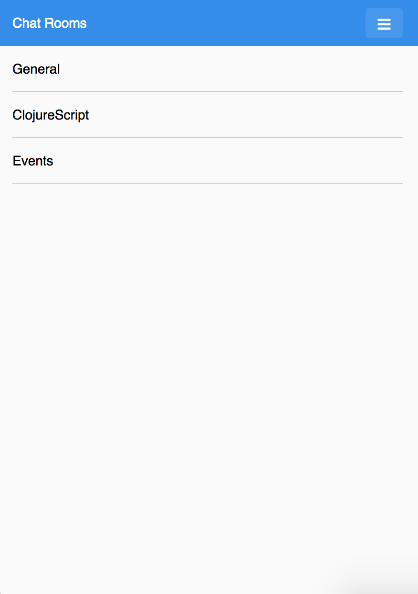
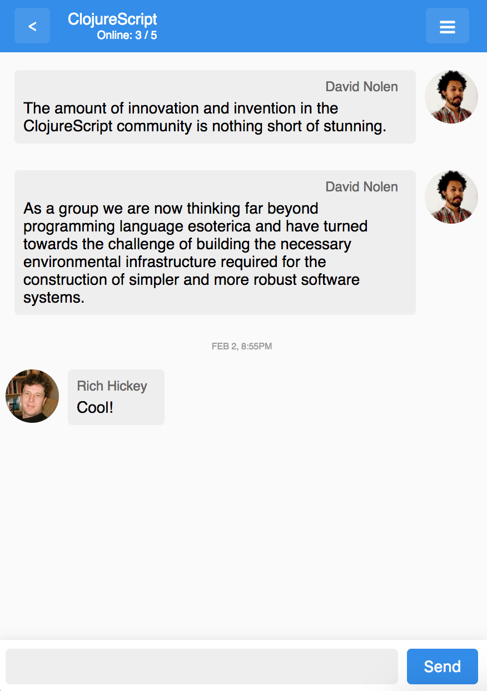
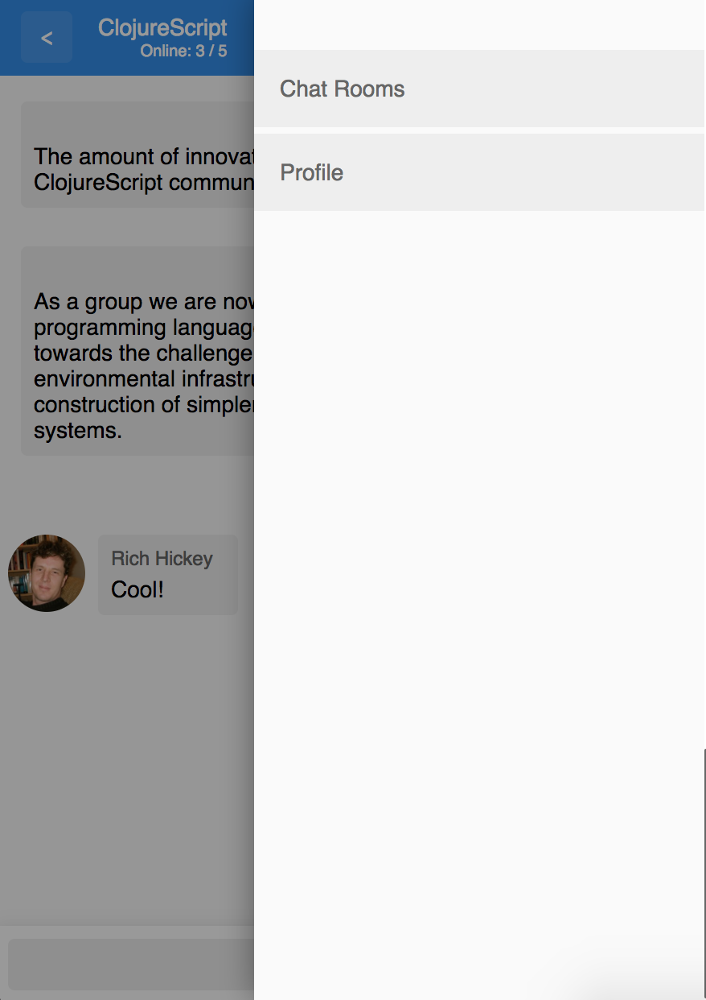

# cheetah


_“Cheetah”_ is the name of a web app that you are going to build. It is a chat web application where a user can sign in, set up a profile and start talking to other users.

## Table of contents

- [Getting started](#getting-started)
- [App structure](#app-structure)
- [Requirements](#requirements)
- [Recommendations](#recommendations)
- [Libraries](#libraries)
- [Development](#development)
- [Production](#production)

## Getting started

If you are not familiar with component-based UIs, make sure to checkout an example of chat screen design ([localhost:3000/designs.html](http://localhost:3000/designs.html)) divided into components. You'll get the general idea of how to divide HTML into separate components which later could be implemented with React/Rum.

## App structure

The app consists of 4 screens and an off-canvas menu:

- _Sign In_
- _Profile_
- _Chat Rooms_ list
- _Chat Room_

A screen is basically a combination of a _header_, _main_ and _footer_ components, which represent a _base layout_ on the screen. A top level component of the app would perform routing, we are going to use [Bide](https://github.com/funcool/bide) and [Pushy](https://github.com/kibu-australia/pushy) libraries to implement client-side navigation. Here's a sketch of screen and app structure:




The markup and styles are already done. You can find HTML to all screens in `resources/public/screens.html` file.







## Requirements

It is not required to implement authorization and some other things that are needed for production apps during this hackathon (because we mainly focused on UI development), but you can do whatever you want 🙂

- You can use any kind of a backend, which suits for a messenger app you are familiar with ([Firebase](https://firebase.google.com/), [PubNub](https://www.pubnub.com/), etc.)
- When a user logs in the username should be stored somewhere (on the backend, localStorage, etc.)
- On the profile screen a user should be able to upload an avatar. Store it locally (in localStorage in base64 encoding) or on the backend
- On chat screen when message input is empty, the `Send` button should be disabled

## Recommendations

- Start with _Sign In_ screen, which is the simplest one to understand basics of Rum
- After that implement _Chat rooms_ screen to get the idea of how to render lists
- Once you feel comfortable with Rum go and implement _Chat Room_ screen

## Libraries

- [Rum](https://github.com/tonsky/rum/) (rendering)
- [Bide](https://github.com/funcool/bide) (routing)
- [Pushy](https://github.com/kibu-australia/pushy) (HTML5 pushState)

## Development

Run dev server & designs

```
rlwrap lein figwheel dev designs
```

Open the following two URLs


- The app [localhost:3000](http://localhost:3000/)
- Design of the chat screen divided into components [localhost:3000/designs.html](http://localhost:3000/designs.html)
- Designs of all screens [localhost:3000/screens.html](http://localhost:3000/screens.html)

## Production

Run the compiler

```
lein cljsbuild once min
```

Once compilation is done the output bundle will be placed at `resources/public/js/compiled/cheetah.js`
